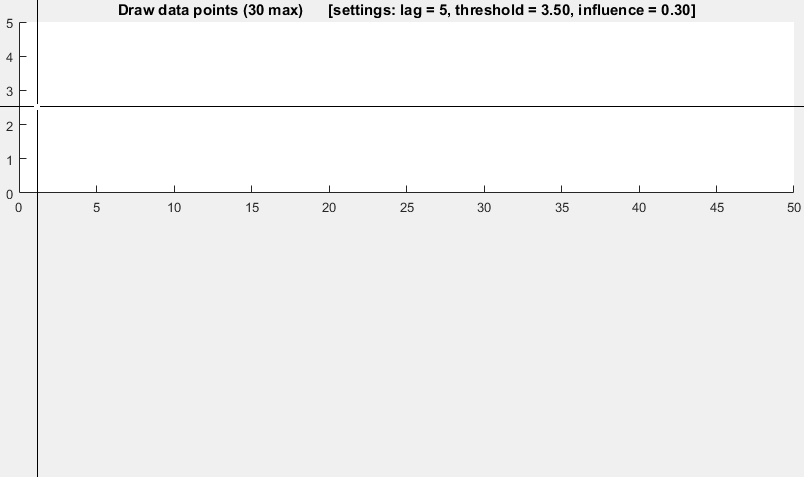

# Just another repo of Python scripts and codes

## Scripts

- [Port Scan](scripts/portscan.py)
- [Brute force SSH logins using paramiko](scripts/ssh-dictionary-attack.py)

## Algorithms

- [Sort Algorithms](pySorting/README.md)
- [find length of sequences of identical values in a numpy array (run length encoding)](algorithms/run-length-encoding.md)
- [Smoothed z-score algo (very robust thresholding algorithm)](algorithms/ThresholdingAlgo.py)

Demo of thresholding algorithm

## Great plots

